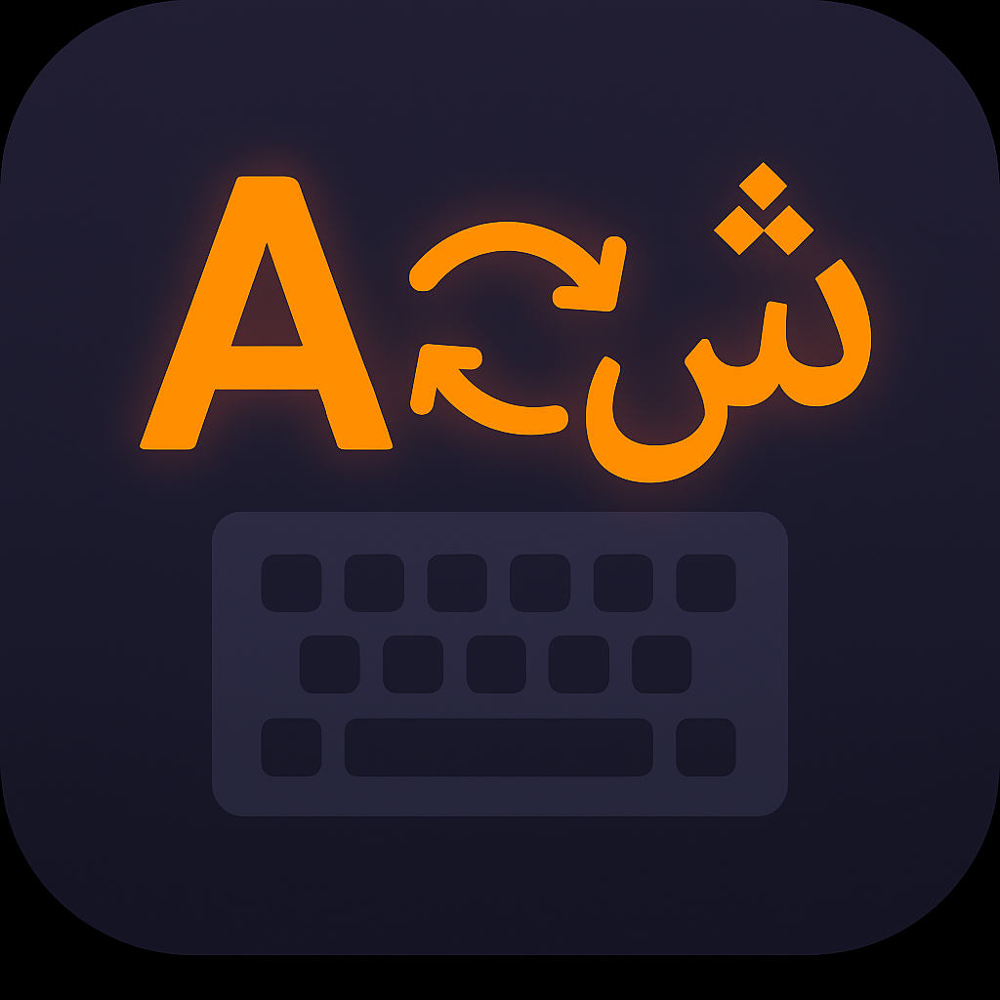
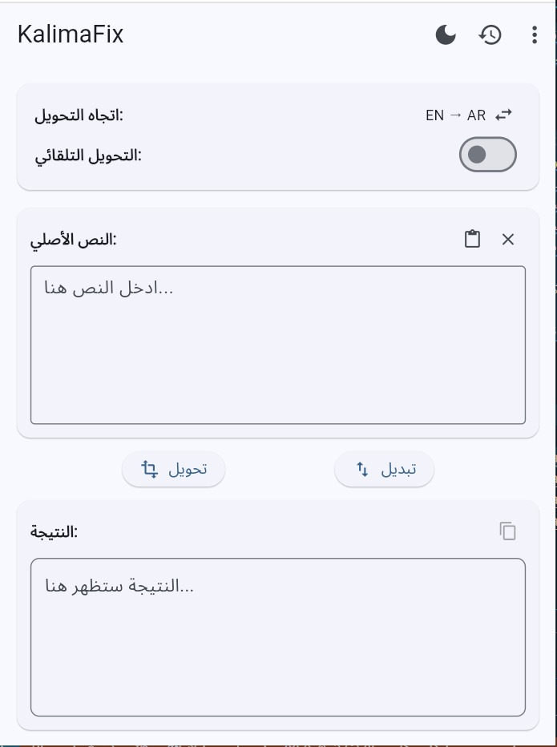
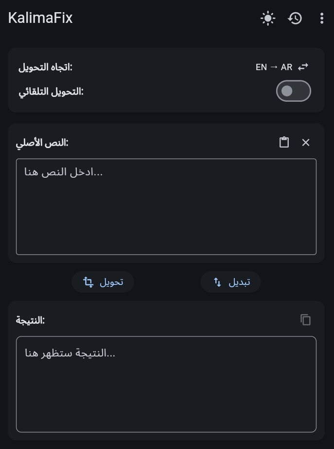
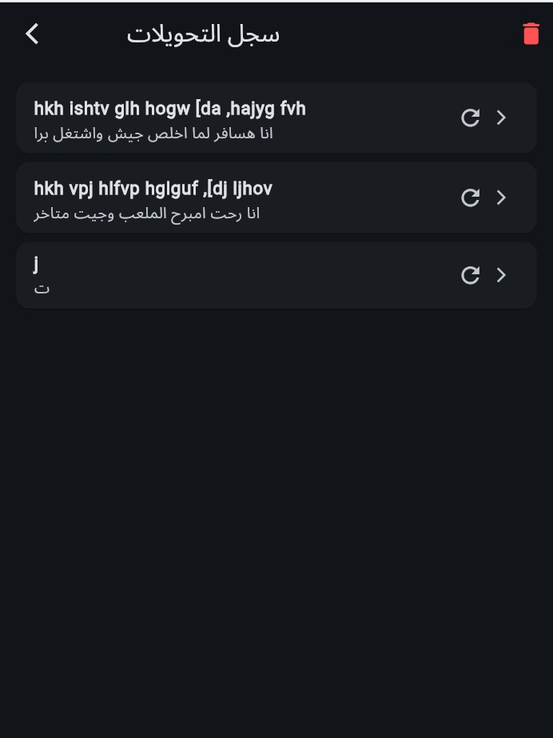

# 🌐 KalimaFix  

هل كتبت مرة بالعربي واكتشفت إن الكيبورد كان إنجليزي (أو العكس)؟  
فتلاقي الكلام اللي كتبته مش مفهوم خالص 🤯  
هنا ييجي دور **KalimaFix**: التطبيق البسيط والذكي اللي بيرجعلك النص اللي كنت تقصده فعلًا ✨.  

---

## 🚀 المميزات
- 🔄 **التحويل بين العربية والإنجليزية** بسهولة (عربي ➝ إنجليزي والعكس).  
- 📋 **لصق النصوص مباشرة** من الكليب بورد.  
- 📑 **نسخ النصوص المحوّلة** بضغطة زر.  
- ⚡ **وضع التحويل التلقائي**: أي كتابة تتحول في نفس اللحظة.  
- 🖊️ **الوضع اليدوي**: اكتب النص بالكامل وبعدين حوّله دفعة واحدة.  
- 🌙 **الوضع الليلي (Dark Theme)** و ☀️ **الوضع الفاتح (Light Theme)**.  
- 🕑 **صفحة تاريخ التحويلات**: عشان تقدر ترجع لأي نص حولته قبل كده.  
- 🧹 **اختصارات سريعة (Shortcuts)** من الـ AppBar لمسح النصوص أو إدارة التخزين.  
- 🔄 **تحديثات مستمرة** لإضافة مميزات جديدة ومبتكرة.  

---

## 📸 صور من التطبيق

  
  
  
  
  

---

---

## 🛠️ المستقبل
- دعم لغات إضافية.  
- إضافة Widgets أسرع للتحويل من أي مكان.  
- تحسينات على الأداء وتجربة المستخدم.  
- مزامنة التحويلات مع Cloud.  

---

## 🤝 المساهمة
لو عندك أفكار أو اقتراحات أو حابب تضيف ميزة،  
افتح Issue أو اعمل Pull Request على الريبو ✨  

---
 

